# IncidentFox System Architecture - SOC2 Compliance Documentation

**Last Updated:** 2026-01-28
**Status:** Production
**Document Type:** SOC2 System Description

---

## System Architecture Diagram

```mermaid
flowchart TB
    subgraph External["External Systems"]
        Users["End Users<br/>(Web Browser)"]
        Slack["Slack<br/>(Event Subscriptions)"]
        GitHub["GitHub<br/>(Webhooks)"]
        PagerDuty["PagerDuty<br/>(V3 Webhooks)"]
        IncidentIO["Incident.io<br/>(Webhooks)"]
    end

    subgraph CustomerEnv["Customer Environment"]
        ExtAPIs["Customer APIs<br/>Datadog, Grafana,<br/>Coralogix, Snowflake,<br/>Kubernetes, AWS"]
    end

    subgraph IncidentFoxAWS["IncidentFox AWS Infrastructure (SaaS)"]
        APIGateway["API Gateway<br/>(HTTPS Proxy)"]
        ALB["Application Load Balancer<br/>(Kubernetes Ingress)"]

        subgraph EKS["EKS Cluster (incidentfox namespace)"]
            subgraph ControlPlane["Control Plane"]
                Orchestrator["Orchestrator<br/>─────────────<br/>• Webhook routing<br/>• Signature verification<br/>• Team provisioning<br/>• K8s resource mgmt"]
            end

            subgraph DataPlane["Data Plane - Core Services"]
                ConfigService["Config Service<br/>─────────────<br/>• Hierarchical config<br/>• Token validation<br/>• RBAC enforcement<br/>• Audit logging"]

                AgentService["Agent Service<br/>─────────────<br/>• Multi-agent system<br/>• 100+ tools<br/>• MCP integration<br/>• Slack output"]

                SREAgent["SRE Agent<br/>─────────────<br/>• Claude SDK<br/>• K8s sandboxes<br/>• gVisor isolation"]
            end

            subgraph AILayer["Self-Improvement Pipeline"]
                AIPipeline["Self-Improvement<br/>Pipeline<br/>─────────────<br/>• Bootstrap learning<br/>• Gap analysis<br/>• Tool codegen<br/>• Evaluation"]
            end

            subgraph RAGLayer["RAG System"]
                RAG["RAG System<br/>─────────────<br/>• Tree-organized retrieval<br/>• Knowledge graph<br/>• Semantic search<br/>• Q&A with citations<br/>• Entity relationships"]
            end

            subgraph Observability["Observability"]
                Telemetry["Telemetry<br/>Collector<br/>─────────────<br/>• Usage metrics<br/>• Analytics"]
            end

            subgraph Frontend["Frontend"]
                WebUI["Web UI<br/>─────────────<br/>• Admin console<br/>• Config mgmt<br/>• KB explorer<br/>• Audit logs"]
            end
        end

        subgraph Storage["Data Storage"]
            RDS[("RDS PostgreSQL<br/>─────────────<br/>• org_nodes<br/>• node_configurations<br/>• team_tokens<br/>• agent_runs<br/>• audit_logs")]
            S3[("S3<br/>─────────────<br/>• RAG trees<br/>• Artifacts")]
            SecretsManager["Secrets Manager<br/>─────────────<br/>• API keys<br/>• Credentials"]
        end

        ECR["ECR<br/>(Container Registry)"]
        CloudWatch["CloudWatch<br/>(Logs & Metrics)"]
    end

    %% User access to Web UI
    Users -->|HTTPS| ALB
    Users -->|HTTPS| APIGateway

    %% External webhooks to AWS Gateway
    Slack -->|Webhooks| APIGateway
    GitHub -->|Webhooks| APIGateway
    PagerDuty -->|Webhooks| APIGateway
    IncidentIO -->|Webhooks| APIGateway

    %% Gateway to ALB
    APIGateway -->|Routes| ALB

    %% ALB to Services
    ALB -->|Routes| Orchestrator
    ALB -->|Routes| WebUI
    ALB -->|Routes| ConfigService
    ALB -->|Routes| AgentService
    ALB -->|Routes| RAG

    %% Orchestrator flows
    Orchestrator -->|Verify auth| ConfigService
    Orchestrator -->|Trigger runs| AgentService
    Orchestrator -->|Trigger bootstrap| AIPipeline
    Orchestrator -->|Create K8s resources| EKS
    Orchestrator -->|Audit logs| RDS

    %% Config Service flows
    ConfigService -->|Read/Write| RDS
    ConfigService -->|Fetch secrets| SecretsManager

    %% Agent flows
    AgentService -->|Read config| ConfigService
    AgentService -->|Query| RAG
    AgentService -->|Execute tools| ExtAPIs
    AgentService -->|Post results| Slack
    AgentService -->|Log traces| RDS

    %% SRE Agent
    SREAgent -->|Read config| ConfigService

    %% AI Pipeline flows
    AIPipeline -->|Ingest docs| RAG
    AIPipeline -->|Store artifacts| S3
    AIPipeline -->|Log runs| RDS
    AIPipeline -->|Update config| ConfigService

    %% RAG flows
    RAG -->|Cache trees| S3
    RAG -->|Store metadata| RDS

    %% Web UI flows
    WebUI -->|Auth/config| ConfigService
    WebUI -->|View KB| RAG
    WebUI -->|View runs| RDS
    WebUI -->|Provision teams| Orchestrator

    %% Telemetry flows
    Telemetry -->|Read metrics| RDS

    %% Infrastructure flows
    ECR -->|Provide images| EKS
    EKS -->|Send logs| CloudWatch
```



---

## Component Descriptions

### 1. Orchestrator (Control Plane)

**Purpose:** Central control plane for webhook routing and team provisioning.

| Aspect | Details |
|--------|---------|
| **Responsibilities** | Webhook routing, signature verification, team provisioning, K8s resource management |
| **Authentication** | Admin tokens with RBAC (`admin:*` permission) |
| **Webhook Sources** | Slack (X-Slack-Signature), GitHub (X-Hub-Signature-256), PagerDuty (X-PagerDuty-Signature), Incident.io (X-Incident-Signature) |
| **Data Storage** | Postgres (`orchestrator_provisioning_runs`, `orchestrator_team_slack_channels`) |
| **Idempotency** | Postgres advisory locks + idempotency keys |

### 2. Config Service (Central Authority)

**Purpose:** Single source of truth for configuration, authentication, and authorization.

| Aspect | Details |
|--------|---------|
| **Responsibilities** | Hierarchical configuration management, token validation, RBAC enforcement, audit logging |
| **Config Hierarchy** | Organization → Business Unit → Team (deep-merge inheritance) |
| **Token Types** | Global Admin, Org Admin (`{org_id}.{random}`), Team (`{org_id}.{team_id}.{random}`) |
| **Auth Modes** | Token-based, OIDC (Google, Azure AD, Okta) |
| **Database Tables** | `org_nodes`, `node_configurations`, `team_tokens`, `org_admin_tokens`, `node_config_audit`, `org_settings` |
| **Security** | Token hashing, immutable field enforcement, audit trail |

### 3. Agent Service (Execution Engine)

**Purpose:** Execute AI agents for incident investigation and automation.

| Aspect | Details |
|--------|---------|
| **Architecture** | Multi-agent system with Planner + 30+ specialized sub-agents |
| **Tool Categories** | Kubernetes (9), AWS (8), Anomaly Detection (8), Grafana (6), GitHub (16), Docker (15), Datadog (3), and 50+ more |
| **Integrations** | MCP (Model Context Protocol) for dynamic tool loading |
| **Output** | Direct Slack posting with Block Kit UI, progressive updates |
| **Data Storage** | `agent_runs`, `tool_calls`, traces in Postgres |

### 4. SRE Agent (Interactive Investigation)

**Purpose:** Interactive code investigation with isolated sandboxes.

| Aspect | Details |
|--------|---------|
| **SDK** | Claude SDK with interrupt/resume support |
| **Isolation** | K8s sandboxes with gVisor |
| **Tools** | Read, Edit, Bash, Grep, Glob (built-in only) |
| **Persistence** | 2-hour filesystem TTL |

### 5. Self-Improvement Pipeline (formerly AI Pipeline)

**Purpose:** Continuous agent improvement through learning.

| Aspect | Details |
|--------|---------|
| **Bootstrap Phase** | Analyzes 90 days of historical data |
| **Gap Analysis** | Detects missing tools, prompts, knowledge |
| **MCP Codegen** | Generates tool implementations, smoke testing |
| **Approval Gate** | Creates GitHub PRs for human review |
| **Premium Feature** | Requires enterprise license |

### 6. RAG System

**Purpose:** Operational knowledge storage and retrieval for AI agents.

| Aspect | Details |
|--------|---------|
| **Algorithm** | RAPTOR (Recursive Abstractive Processing for Tree-Organized Retrieval) |
| **Features** | Tree-organized retrieval, knowledge graph, semantic search, Q&A with citations, entity relationships |
| **Knowledge Types** | Procedural, Factual, Relational, Temporal, Social, Contextual, Policy, Meta |
| **Storage** | S3 (tree artifacts), PostgreSQL (metadata, graph) |
| **API Endpoints** | `/health`, `/trees`, `/search`, `/answer`, `/retrieve` |

### 7. Telemetry Collector

**Purpose:** Internal usage metrics collection for product analytics.

| Aspect | Details |
|--------|---------|
| **Heartbeat** | Every 5 minutes |
| **Daily Analytics** | 2:00 AM UTC |
| **Opt-Out** | Org-level setting, immediate effect (within 5 minutes) |
| **Data Collected** | Aggregate metrics only (counts, success rates, duration) |
| **Data NOT Collected** | PII, credentials, prompts, conversation content |

### 8. Web UI

**Purpose:** Admin console and team configuration interface for customers.

| Aspect | Details |
|--------|---------|
| **Technology** | Next.js |
| **Access** | Customers access via web browser (HTTPS) |
| **Features** | Org tree visualization, integration config, policy management, audit logging, KB explorer, agent run history, telemetry settings |
| **Authentication** | SSO via OIDC (Google, Azure AD, Okta) |

---

## Data Flow Diagrams

### Webhook Request Flow (Slack @mention)

```
1. User @mentions IncidentFox in Slack
2. Slack → API Gateway → ALB → Orchestrator (< 3 seconds)
3. Orchestrator:
   a. Verify X-Slack-Signature
   b. Return 200 OK to Slack
   c. Extract slack_channel_id
   d. Query Config Service for team lookup
   e. Get impersonation token (short-lived)
4. Orchestrator → Agent Service (async POST /api/v1/agent/run)
5. Agent Service:
   a. Post "Investigating..." to Slack
   b. Read effective config from Config Service
   c. Query RAG system for relevant knowledge
   d. Execute tools (Datadog, K8s, Coralogix, etc.)
   e. Update Slack with progress
   f. Post final RCA and recommendations
6. Agent logs traces to PostgreSQL
```

### Configuration Resolution Flow

```
GET /api/v1/config/me/effective
│
├─ Config Service validates team token
│  └─ Returns: {org_id, team_node_id}
│
├─ Query lineage: SELECT lineage FROM org_nodes WHERE id = team_node_id
│  └─ Lineage: [org_root, business_unit, team]
│
├─ Batch-load configs for all nodes in lineage
│  ├─ org_root config:    {agents, tools, mcp_servers}
│  ├─ business_unit config: {agents.prompt_override}
│  └─ team config:        {agents.disable_tools: [...]}
│
├─ Deep-merge (root → leaf, later wins)
│  └─ effective = merged config
│
└─ Return effective config to caller
```

### Team Provisioning Flow

```
POST /api/v1/admin/provision/team
│
├─ Acquire Postgres advisory lock (org_id, team_node_id)
│
├─ Config Service operations:
│  ├─ Create org node (if needed)
│  ├─ Create team node
│  ├─ Set routing configuration
│  └─ Issue team token
│
├─ K8s operations:
│  ├─ Create CronJob for AI Pipeline (if scheduled)
│  └─ Create Deployment for dedicated agent (if enterprise)
│
├─ AI Pipeline: Trigger bootstrap
│
├─ Record provisioning_run (audit)
│
├─ Release lock
│
└─ Return provisioning_run_id, team_token
```

---

## Security Controls

### Authentication

| Control | Implementation |
|---------|----------------|
| Token Types | Global Admin, Org Admin, Team (hierarchical scopes) |
| Token Storage | Hashed in database (SHA-256) |
| Token Validation | Config Service validates all requests |
| OIDC Support | Google, Azure AD, Okta (per-organization) |
| Webhook Auth | Signature verification (HMAC-SHA256) |

### Authorization

| Control | Implementation |
|---------|----------------|
| RBAC | Role-based access control (`admin:*`, `admin:provision`, etc.) |
| Team Isolation | Token scoped to org_id + team_node_id |
| Config Inheritance | Policies enforced at org level, inherited by teams |

### Data Protection

| Control | Implementation |
|---------|----------------|
| Encryption in Transit | TLS for all communications |
| Encryption at Rest | RDS encryption, S3 encryption |
| Secrets Management | AWS Secrets Manager |
| Network Isolation | RDS in private subnet (VPC-internal only) |

### Audit & Logging

| Control | Implementation |
|---------|----------------|
| Config Changes | `node_config_audit` table (immutable log) |
| Provisioning | `orchestrator_provisioning_runs` table |
| Agent Runs | `agent_runs` table with full traces |
| Webhook Events | Logged before processing |
| Telemetry | Org-level opt-in/opt-out tracked |

### Multi-Tenancy

| Mode | Description |
|------|-------------|
| Shared Mode | Teams share agent pods, config-based isolation via tokens |
| Dedicated Mode | Teams get isolated agent deployments (enterprise) |

---

## Infrastructure Components

### AWS Services

| Service | Purpose |
|---------|---------|
| EKS | Kubernetes cluster (`incidentfox` namespace) |
| RDS PostgreSQL | Primary database (private subnet) |
| ECR | Docker image registry |
| ALB | Load balancer for K8s ingress |
| API Gateway | HTTPS proxy for webhooks |
| S3 | RAG tree storage, artifacts |
| Secrets Manager | Credential storage |
| CloudWatch | Logs and metrics |

### Kubernetes Resources

| Resource | Purpose |
|----------|---------|
| Deployments | config-service, agent, orchestrator, web-ui, rag |
| Services | Internal service discovery |
| Ingress | ALB routing |
| CronJobs | AI Pipeline schedules |
| Secrets | External Secrets Operator → Secrets Manager |
| HPA | Auto-scaling based on CPU |

---

## External Dependencies

### Third-Party Integrations

| Service | Integration Type | Purpose |
|---------|-----------------|---------|
| Slack | Bot (Event Subscriptions, Interactivity) | User interaction, notifications |
| GitHub | App (Webhooks) | Code analysis, PR comments |
| PagerDuty | Webhooks (V3) | Incident triggers |
| Incident.io | Webhooks | Incident triggers |
| Datadog | API | Metrics, APM data |
| Grafana | API | Dashboard queries |
| Coralogix | API | Log queries (DataPrime) |
| Snowflake | API | Incident enrichment data |

---

## Compliance Considerations

### Data Handling

- **No PII Storage**: System does not store personal information beyond team membership
- **Credential Isolation**: API keys stored in Secrets Manager, never in database
- **Audit Trail**: Complete change history for all configuration changes
- **Data Retention**: Configurable per schema

### Telemetry Privacy

- **Opt-Out Available**: Organizations can disable telemetry via UI or API
- **Immediate Effect**: Changes take effect within 5 minutes
- **Aggregate Only**: Only aggregate metrics collected (counts, averages, percentiles)
- **No Content**: Prompts, conversations, and knowledge base content never sent

### Access Control

- **Least Privilege**: IAM roles with minimal permissions
- **Token Scoping**: Tokens scoped to organization and team
- **Webhook Verification**: All webhooks verified via signatures
- **Network Boundaries**: Database accessible only within VPC
